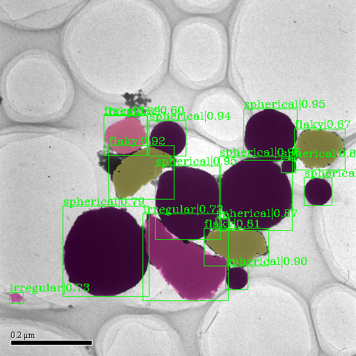

# CoMask
This repo. is an official implementation of the *CoMask*, which  has been submitted to the journal *Nature Machine Intelligence, 2023*.

Example


## Installation
- Please refer to [INSTALL.md](docs/INSTALL.md) of mmdetection. 

## Train and Inference on COCO dataset
Please use the following commands for training and testing by single GPU or multiple GPUs.


#####  Train with a single GPU
```shell
python tools/train.py ${CONFIG_FILE}
```

#####  Train with multiple GPUs

```shell
./tools/dist_train.sh ${CONFIG_FILE} ${GPU_NUM} [optional arguments]
```
#####  Test with a single GPU

```shell
python tools/test.py ${CONFIG_FILE} ${CHECKPOINT_FILE} [--out ${RESULT_FILE}] [--eval ${EVAL_METRICS}] [--show]
```

#####  Test with multiple GPUs

```shell
./tools/dist_test.sh ${CONFIG_FILE} ${CHECKPOINT_FILE} ${GPU_NUM} [--out ${RESULT_FILE}] [--eval ${EVAL_METRICS}]
```

- CONFIG_FILE about D2Det is in [configs/D2Det](configs/D2Det), please refer to [GETTING_STARTED.md](docs/GETTING_STARTED.md) for more details.

## Train and Inference on microscopy images
./tools/dist_train.sh configs/CoMask/CoMask_r50_mfpn_2x.py 4 --load_from='./checkpoints/coco_epoch_24.pth'

## Annotation of Data
For the annotation of segmentation we recommend the use of the labelme, that can be found here: https://github.com/wkentaro/labelme.
